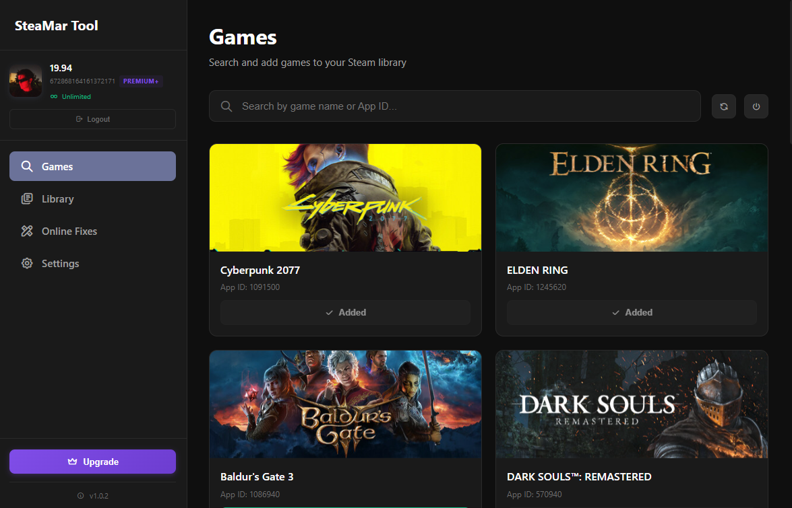

# SteaMar Tool

  

  <strong>SteaMar</strong> is a Windows tool for managing Steam game manifests, Lua activation scripts, and online fixes — all in one place.

  <a href="https://github.com/omaralhami/SteaMar-Tool/releases">Download</a> •
  <a href="https://discord.gg/UkdAQ8q8Et">Discord</a> •
  <a href="https://steamartool.vercel.app/">Website</a>

---

## Overview

SteaMar is built for users who want a clean and fast way to manage Steam-related files without doing everything manually.

The tool works locally on your device and uses **Discord** for authentication, access control, and plan management.  
No Steam credentials are stored.

---

## Tool preview

  

---

## How it works

1. Install and open SteaMar
2. Log in using Discord  
   > You must be a member of the SteaMar Discord server to log in
3. Browse games, manifests, and fixes inside the tool
4. Add games to Steam or apply fixes
5. Your Discord role controls your access level

Join the Discord server here:  
👉 https://discord.gg/UkdAQ8q8Et

---

## Plans & access

Access is based on Discord roles linked to your plan.

### Free
- 1 download per day

### Premium
- 10 downloads per day  
- Manual game updates through the Discord bot

### Premium +
- Unlimited downloads  
- Automatic game updates inside the tool  
- Access to online games fixes

You can upgrade your plan **from inside the tool** using secure payments via **Ko-fi/PayPal**.  
Once payment is completed, access is granted instantly through the Discord bot.

---

## Features

- Add games to your Steam library
- Download and manage Steam manifests
- Apply Lua activation scripts
- Browse online fixes
- Automatic updates (Premium+)
- Arabic and English language support
- Discord-based authentication